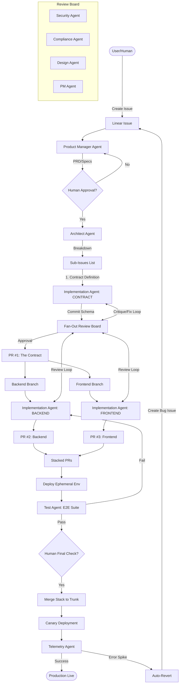

# The Middle-Out Agentic Software Factory
## An Architecture for Autonomous, Contract-Driven Development

### 1. Executive Summary
This document outlines a proposed architecture for an autonomous software development lifecycle (SDLC) that moves beyond simple "AI Copilots" into a rigorous, industrial-grade "Software Factory."

The core philosophy is **"Middle-Out Development."** Instead of letting AI agents write code in an unstructured manner, the system enforces a strict separation of concerns where the **Data Contract (API Schema/JSON Payload)** is the immutable source of truth.

This architecture leverages:
* **Specialized Agents:** Distinct personas (PM, Security, Design) to enforce checks and balances.
* **Stacked PRs:** Managing complexity by breaking features into atomic, dependent units.
* **Adversarial Review Loops:** Agents critique other agents to simulate a high-bar engineering culture.
* **Shift-Left Validation:** Security and compliance are validated at the definition phase, not just implementation.

---

### 2. The Problem: Why Current AI Dev Fails
Most current approaches to AI-driven software development fall into two categories, both of which struggle at scale:

1.  **The "God Agent" (e.g., Devin):** Tries to hold the entire context in one context window.
    * *Failure Mode:* Hallucinations increase with complexity; inability to "backtrack" easily; creates monolithic, unreviewable PRs.
2.  **The "Copilot" (e.g., Cursor):** Relies on the human to be the architect and reviewer.
    * *Failure Mode:* The human becomes the bottleneck; the AI generates code that "looks" right but fails edge cases or security standards.

**Key Issues Solved by this Architecture:**
* **Hallucination/Drift:** By freezing the *Contract* first, Frontend and Backend agents cannot "invent" incompatible logic.
* **Review Fatigue:** Humans cannot effectively review 500 lines of AI code. Stacking PRs forces agents to submit 50-line, logical chunks.
* **Integration Hell:** Traditional "Frontend first" or "Backend first" leads to mismatch. "Middle-Out" forces agreement before coding begins.

---

### 3. The Solution: Middle-Out & Stacked PRs
This architecture treats the software process as a directed graph of agent interactions, anchored by the **Contract**.

#### Key Differentiators vs. Alternatives

| Feature | Standard "God Agent" | **The Middle-Out Factory** |
| :--- | :--- | :--- |
| **Starting Point** | "Write the code." | "Define the Contract (Schema)." |
| **Review Process** | Single pass or Human-only. | **Fan-Out Adversarial Board** (Security vs. PM vs. Dev). |
| **Git Strategy** | Single massive commit. | **Stacked PRs** (Schema → Backend → Frontend). |
| **Safety** | Reactive (fix bugs later). | **Proactive** (Design & Compliance review the Plan). |
| **Rollout** | Binary (Deploy/Fail). | **Canary with Auto-Revert** & Telemetry Loop. |

---

### 4. Process Visualization (Mermaid.js)

### 5. Actor Registry (The Agents)

#### A. Planning & Orchestration

1. **Product Manager (PM) Agent:**
* *Input:* Vague user idea.
* *Focus:* User value, requirements fidelity, edge cases.
* *Goal:* Ensure the "Why" is clear before the "How" is decided.

2. **Software Architect Agent:**
* *Input:* Approved PRD.
* *Focus:* System design, dependency graphing.
* *Goal:* Break the work into "Middle-Out" order (Contract -> Implementation).

3. **Supervisor (The Orchestrator):**
* *Focus:* Process integrity.
* *Goal:* Manage loops (prevent infinite agent arguments), merge conflicts, and git operations.

#### B. Implementation

4. **Software Implementation Agent:**
* *Modes:* Contract Mode (Pydantic/JSON), Backend Mode (Python/SQL), Frontend Mode (React/TS).
* *Focus:* Writing clean, functioning code that passes the linter and the Review Board.

#### C. The Review Board (Adversarial Critics)

5. **Security Agent:**
* *Persona:* Paranoid InfoSec Engineer.
* *Checks:* OWASP Top 10, PII leakage, AuthZ verification.

6. **Compliance Agent:**
* *Persona:* Legal/Audit Officer.
* *Checks:* GDPR, Logging standards, Accessibility (A11y).

7. **Design Agent:**
* *Persona:* Design System Purist.
* *Checks:* UI consistency, component reuse, schema-to-UI feasibility.

#### D. Operations

8. **Test Automation Agent:**
* *Focus:* Regression testing.
* *Action:* Writes and runs Playwright/Pytest suites against the ephemeral env.

9. **Telemetry & Rollout Agent:**
* *Focus:* Production health.
* *Action:* Manages canary weights; triggers "The Big Red Button" (revert) if metrics degrade.

---

### 6. SWOT Analysis

| **Strengths (Internal)** | **Weaknesses (Internal)** |
| --- | --- |
| **High Reliability:** "Contract-First" prevents 80% of integration bugs. | **Complexity:** Setting up the orchestration (LangGraph + Git Hooks + Ephemeral Envs) is a heavy lift. |
| **Auditability:** Every decision (PM, Security, Code) is recorded in the ticket history. | **Latency:** Sequential review loops take time. A "quick fix" might take 10 minutes to process through agents. |
| **Scalability:** The "Fan-Out" pattern allows specialized reviews without human bottleneck. | **Cost:** Running 5+ agents per commit (especially with stacked PRs) incurs significant token costs. |

| **Opportunities (External)** | **Threats (External)** |
| --- | --- |
| **SaaS Potential:** This architecture is generic enough to be a "Jira/Linear for AI" product. | **Model Volatility:** If underlying models (OpenAI/Anthropic) change behavior, strict prompting flows may break. |
| **Standardization:** Could become the "ISO Standard" for AI software development. | **"Good Enough" Agents:** If a future "GPT-6" is perfect at coding, the rigorous process might feel like overkill. |

---

### 7. Implementation Roadmap

#### Phase 1: The Brain (Local Prototype)

* **Goal:** Validate the "Review Board" concept.
* **Stack:** LangGraph + Local Python scripts.
* **Action:**
1. Create the `Implementation Agent` that takes a prompt and outputs a Pydantic model.
2. Create the `Security Agent` that critiques that model.
3. Create the `Supervisor` that loops them until agreement.

#### Phase 2: The Body (Git Integration)

* **Goal:** Automate the "Middle-Out" workflow.
* **Stack:** GitHub Actions or Webhooks + Linear API.
* **Action:**
1. Build the "Post-Commit Hook" that triggers the agents.
2. Implement the logic to create a PR from the agent's output.

#### Phase 3: The Assembly Line (Stacking & Deployment)

* **Goal:** Full autonomy.
* **Stack:** Graphite/Git plumbing + Vercel/Neon (Ephemeral).
* **Action:**
1. Script the "Stacked PR" logic (Branching off the Contract branch).
2. Wire up the Telemetry Agent to the Linear API for the auto-revert loop.
