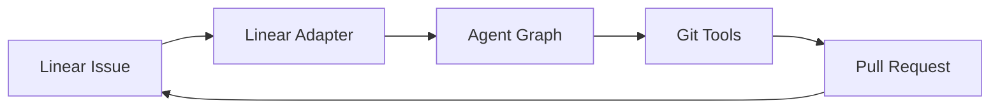

# Phase 2: The Body (Git Integration)

> **Goal:** Automate the "Middle-Out" workflow with Linear integration and Git operations.

This phase connects the agent brain (Phase 1) to external systems, enabling autonomous issue management and code commits.

---

## Overview

Phase 2 extends the factory with:
1. **Linear Adapter** — Poll for issues marked "Ready for AI"
2. **Git Tools** — Branch creation, commits, and PR management
3. **Publisher Node** — Automates the PR creation workflow



---

## Prerequisites

Before starting Phase 2, ensure:
- [x] Phase 1 is complete and `make agent` works
- [ ] Linear workspace with API access
- [ ] GitHub repository with write access
- [ ] GitHub CLI (`gh`) installed and authenticated

---

## 1. Linear Adapter

### 1.1 Create the Adapter Module

Create `agent/adapters/linear_adapter.py`:

```python
import os
import httpx
from typing import Optional, List
from pydantic import BaseModel

LINEAR_API_URL = "https://api.linear.app/graphql"

class LinearIssue(BaseModel):
    id: str
    identifier: str
    title: str
    description: Optional[str]
    state: str
    priority: int
    parent_id: Optional[str] = None

class LinearAdapter:
    """Adapter for Linear API interactions."""
    
    def __init__(self):
        self.api_key = os.getenv("LINEAR_API_KEY")
        if not self.api_key:
            raise ValueError("LINEAR_API_KEY not set")
        self.headers = {
            "Authorization": self.api_key,
            "Content-Type": "application/json"
        }
    
    def _query(self, query: str, variables: dict = None) -> dict:
        """Execute a GraphQL query against Linear."""
        payload = {"query": query}
        if variables:
            payload["variables"] = variables
        
        response = httpx.post(
            LINEAR_API_URL,
            headers=self.headers,
            json=payload
        )
        response.raise_for_status()
        return response.json()
    
    def get_ready_issues(self, team_key: str) -> List[LinearIssue]:
        """Fetch issues in the 'AI: Ready' state."""
        query = '''
        query ReadyIssues($teamKey: String!) {
            team(key: $teamKey) {
                issues(filter: {
                    state: { name: { eq: "AI: Ready" } }
                }) {
                    nodes {
                        id
                        identifier
                        title
                        description
                        state { name }
                        priority
                        parent { id }
                    }
                }
            }
        }
        '''
        result = self._query(query, {"teamKey": team_key})
        issues = result.get("data", {}).get("team", {}).get("issues", {}).get("nodes", [])
        
        return [
            LinearIssue(
                id=issue["id"],
                identifier=issue["identifier"],
                title=issue["title"],
                description=issue.get("description"),
                state=issue["state"]["name"],
                priority=issue["priority"],
                parent_id=issue.get("parent", {}).get("id") if issue.get("parent") else None
            )
            for issue in issues
        ]
    
    def transition_issue(self, issue_id: str, state_name: str) -> bool:
        """Move an issue to a different state."""
        # First, get the state ID
        state_query = '''
        query GetState($name: String!) {
            workflowStates(filter: { name: { eq: $name } }) {
                nodes { id }
            }
        }
        '''
        state_result = self._query(state_query, {"name": state_name})
        states = state_result.get("data", {}).get("workflowStates", {}).get("nodes", [])
        
        if not states:
            return False
        
        state_id = states[0]["id"]
        
        mutation = '''
        mutation UpdateIssue($id: String!, $stateId: String!) {
            issueUpdate(id: $id, input: { stateId: $stateId }) {
                success
            }
        }
        '''
        result = self._query(mutation, {"id": issue_id, "stateId": state_id})
        return result.get("data", {}).get("issueUpdate", {}).get("success", False)
    
    def add_comment(self, issue_id: str, body: str) -> bool:
        """Add a comment to an issue."""
        mutation = '''
        mutation AddComment($issueId: String!, $body: String!) {
            commentCreate(input: { issueId: $issueId, body: $body }) {
                success
            }
        }
        '''
        result = self._query(mutation, {"issueId": issue_id, "body": body})
        return result.get("data", {}).get("commentCreate", {}).get("success", False)
```

### 1.2 Workflow States

Configure these Linear workflow states:

| State Name | Description |
|------------|-------------|
| `AI: Ready` | Issue is ready for AI processing |
| `AI: In Progress` | AI is actively working on this |
| `AI: Review` | AI completed, awaiting human review |
| `AI: Failed` | AI encountered an error |

---

## 2. Git Tools

### 2.1 Create Git Operations Module

Create `agent/tools/git.py`:

```python
import subprocess
from typing import Optional, Tuple

def run_git(*args: str, cwd: str = ".") -> Tuple[bool, str]:
    """Run a git command and return (success, output)."""
    try:
        result = subprocess.run(
            ["git"] + list(args),
            cwd=cwd,
            capture_output=True,
            text=True
        )
        return result.returncode == 0, result.stdout + result.stderr
    except Exception as e:
        return False, str(e)

def create_branch(branch_name: str, base: str = "main") -> bool:
    """Create and checkout a new branch."""
    run_git("fetch", "origin")
    success, _ = run_git("checkout", "-b", branch_name, f"origin/{base}")
    return success

def checkout_branch(branch_name: str) -> bool:
    """Checkout an existing branch."""
    success, _ = run_git("checkout", branch_name)
    return success

def commit_changes(message: str, files: list[str] = None) -> bool:
    """Stage and commit changes."""
    if files:
        for file in files:
            run_git("add", file)
    else:
        run_git("add", "-A")
    
    success, _ = run_git("commit", "-m", message)
    return success

def push_branch(branch_name: str) -> bool:
    """Push branch to origin."""
    success, _ = run_git("push", "-u", "origin", branch_name)
    return success

def create_pr(title: str, body: str, base: str = "main") -> Tuple[bool, Optional[str]]:
    """Create a PR using GitHub CLI and return (success, pr_url)."""
    try:
        result = subprocess.run(
            ["gh", "pr", "create", "--title", title, "--body", body, "--base", base],
            capture_output=True,
            text=True
        )
        if result.returncode == 0:
            # gh pr create outputs the PR URL
            return True, result.stdout.strip()
        return False, result.stderr
    except Exception as e:
        return False, str(e)

def get_current_branch() -> str:
    """Get the current branch name."""
    success, output = run_git("branch", "--show-current")
    return output.strip() if success else ""
```

---

## 3. Publisher Node

### 3.1 Create the Publisher

Create `agent/nodes/publisher.py`:

```python
from agent.state import AgentState
from agent.tools.git import (
    create_branch, commit_changes, push_branch, create_pr, get_current_branch
)
from agent.adapters.linear_adapter import LinearAdapter

def publisher_node(state: AgentState) -> dict:
    """Handle git operations and PR creation."""
    issue = state.get("current_issue")
    if not issue:
        return {"messages": state.get("messages", []) + ["No issue to publish"]}
    
    # Create branch name from issue identifier
    branch_name = f"ai/{issue.identifier.lower()}"
    
    # Create and checkout branch
    if not create_branch(branch_name):
        return {
            "status": "failed",
            "messages": state.get("messages", []) + [f"Failed to create branch {branch_name}"]
        }
    
    # Commit the generated contract
    contract = state.get("current_contract")
    if contract:
        # TODO: Write contract to file
        commit_message = f"feat({issue.identifier}): Add data contract\n\nGenerated by AI Factory"
        commit_changes(commit_message)
    
    # Push and create PR
    push_branch(branch_name)
    success, pr_url = create_pr(
        title=f"[{issue.identifier}] {issue.title}",
        body=f"## Summary\n\n{issue.description or 'AI-generated implementation'}\n\n---\n*Generated by Software Factory*"
    )
    
    if success:
        # Update Linear issue
        adapter = LinearAdapter()
        adapter.transition_issue(issue.id, "AI: Review")
        adapter.add_comment(issue.id, f"✅ PR created: {pr_url}")
        
        return {
            "status": "published",
            "pr_url": pr_url,
            "messages": state.get("messages", []) + [f"PR created: {pr_url}"]
        }
    
    return {
        "status": "failed",
        "messages": state.get("messages", []) + ["Failed to create PR"]
    }
```

---

## 4. Update the Graph

### 4.1 Extend State Schema

Update `agent/state.py` to include issue tracking:

```python
from agent.adapters.linear_adapter import LinearIssue

class AgentState(TypedDict):
    # ... existing fields ...
    current_issue: Optional[LinearIssue]
    pr_url: Optional[str]
```

### 4.2 Add Publisher to Graph

Update `agent/graph.py`:

```python
from agent.nodes.publisher import publisher_node

def build_graph():
    workflow = StateGraph(AgentState)
    
    # Existing nodes
    workflow.add_node("contractor", contractor_node)
    workflow.add_node("security", security_node)
    workflow.add_node("supervisor", supervisor_node)
    
    # New node
    workflow.add_node("publisher", publisher_node)
    
    # Update edges
    workflow.set_entry_point("contractor")
    workflow.add_edge("contractor", "security")
    workflow.add_edge("security", "supervisor")
    
    workflow.add_conditional_edges(
        "supervisor",
        lambda state: state["status"],
        {
            "drafting": "contractor",
            "approved": "publisher",  # Route to publisher on approval
            "failed": END
        }
    )
    
    workflow.add_edge("publisher", END)
    
    return workflow.compile()
```

---

## 5. Create the Polling Loop

### 5.1 Polling Entry Point

Create `agent/poll.py`:

```python
import time
from dotenv import load_dotenv
from agent.graph import app
from agent.state import AgentState
from agent.adapters.linear_adapter import LinearAdapter

load_dotenv()

POLL_INTERVAL = 30  # seconds
TEAM_KEY = "ENG"    # Your Linear team key

def poll_and_process():
    """Poll Linear for ready issues and process them."""
    adapter = LinearAdapter()
    
    print(f"🔄 Polling Linear for issues in 'AI: Ready' state...")
    issues = adapter.get_ready_issues(TEAM_KEY)
    
    if not issues:
        print("   No issues found.")
        return
    
    for issue in issues:
        print(f"\n📋 Processing: {issue.identifier} - {issue.title}")
        
        # Transition to In Progress
        adapter.transition_issue(issue.id, "AI: In Progress")
        
        # Run the factory
        initial_state: AgentState = {
            "task_description": f"{issue.title}\n\n{issue.description or ''}",
            "current_contract": None,
            "review_feedback": [],
            "iteration_count": 0,
            "status": "drafting",
            "messages": [],
            "current_issue": issue,
            "pr_url": None
        }
        
        try:
            result = app.invoke(initial_state)
            
            if result["status"] == "published":
                print(f"   ✅ PR created: {result.get('pr_url')}")
            else:
                adapter.transition_issue(issue.id, "AI: Failed")
                adapter.add_comment(issue.id, f"❌ Failed: {result.get('messages', [])[-1]}")
                print(f"   ❌ Failed: {result['status']}")
        
        except Exception as e:
            adapter.transition_issue(issue.id, "AI: Failed")
            adapter.add_comment(issue.id, f"❌ Error: {str(e)}")
            print(f"   ❌ Error: {e}")

def main():
    """Main polling loop."""
    print("🏭 Software Factory - Phase 2: Linear Integration")
    print("=" * 50)
    
    while True:
        poll_and_process()
        print(f"\n⏳ Sleeping for {POLL_INTERVAL}s...")
        time.sleep(POLL_INTERVAL)

if __name__ == "__main__":
    main()
```

---

## 6. Update Makefile

Add new targets:

```makefile
# Poll Linear for issues
poll:
	PYTHONPATH=. python agent/poll.py

# Run a single poll cycle (no loop)
poll-once:
	PYTHONPATH=. python -c "from agent.poll import poll_and_process; poll_and_process()"
```

---

## 7. Environment Configuration

Update `.env`:

```env
# Linear
LINEAR_API_KEY=lin_api_your-key-here
LINEAR_TEAM_KEY=ENG

# GitHub (ensure gh CLI is authenticated)
# Run: gh auth login
```

---

## 8. Verification Checklist

- [ ] `LINEAR_API_KEY` is set and valid
- [ ] Linear workflow states are configured
- [ ] `gh auth status` shows authenticated
- [ ] `make poll-once` successfully connects to Linear
- [ ] Creating a test issue in "AI: Ready" triggers processing
- [ ] PR is created and issue transitions to "AI: Review"

---

## Next Steps

After Phase 2 is complete:

### Phase 3: The Assembly Line
- Add more reviewer agents (Compliance, Design)
- Implement stacked PR logic (Contract → Backend → Frontend)
- Wire up ephemeral environment deployment
- Add Telemetry Agent for production monitoring
