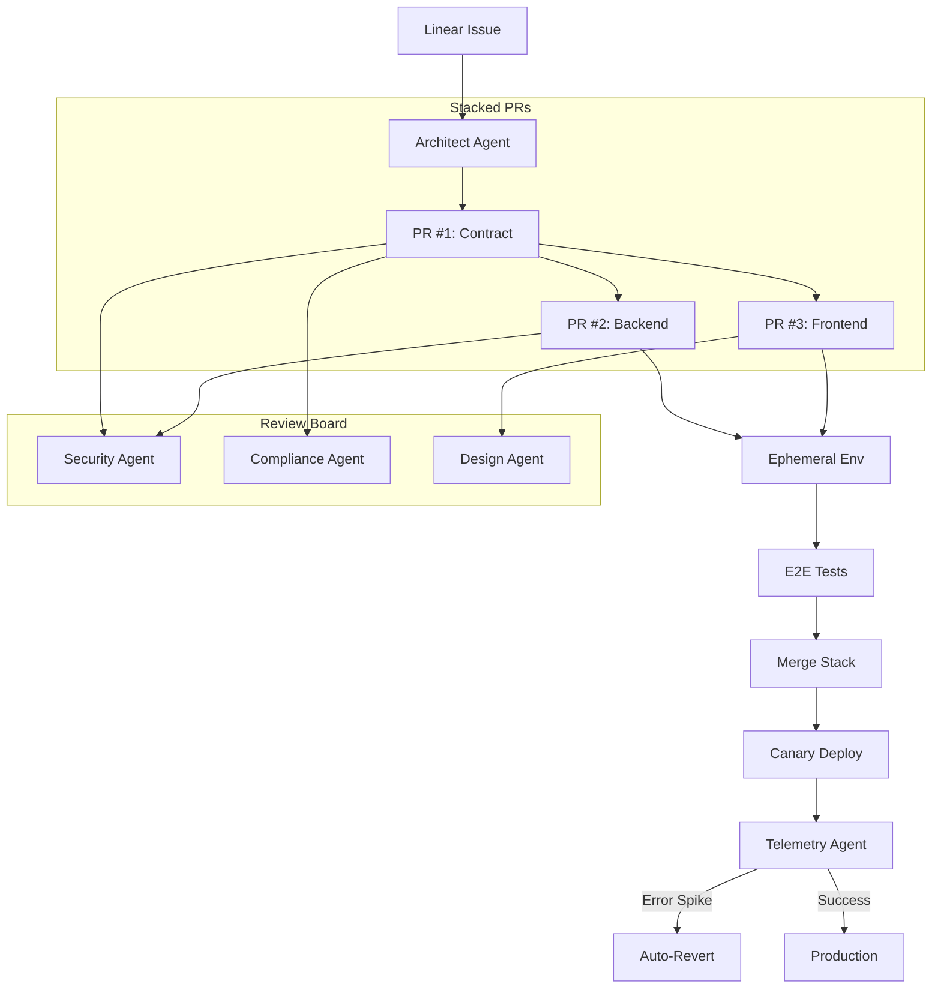

# Phase 3: The Assembly Line (Stacking & Deployment)

> **Goal:** Achieve full autonomy with stacked PRs, ephemeral environments, and production monitoring.

This phase implements the complete "Middle-Out" workflow where Contract → Backend → Frontend are developed in dependent, stacked PRs.

---

## Overview

Phase 3 extends the factory with:
1. **Stacked PR Orchestration** — Contract branch spawns Backend/Frontend branches
2. **Additional Review Agents** — Compliance and Design reviewers
3. **Ephemeral Environments** — Deploy PRs for E2E testing
4. **Telemetry Agent** — Monitor production and auto-revert on failure



---

## Prerequisites

Before starting Phase 3, ensure:
- [x] Phase 1 (Agent Brain) complete
- [x] Phase 2 (Linear + Git) complete
- [ ] Vercel/Netlify account for ephemeral deploys
- [ ] Database provider (Neon/PlanetScale) for ephemeral DBs
- [ ] Error monitoring (Sentry/DataDog) configured

---

## 1. Architect Agent

The Architect breaks down approved PRDs into stacked work items.

### 1.1 Create the Architect Node

Create `agent/nodes/architect.py`:

```python
import json
import re
from langchain_openai import ChatOpenAI
from agent.state import AgentState

llm = ChatOpenAI(model="gpt-4o", temperature=0)

ARCHITECT_PROMPT = """You are a Software Architect breaking down a feature into stacked PRs.

Feature Request:
{task_description}

Break this into exactly 3 ordered work items following Middle-Out methodology:
1. CONTRACT: Define the data schema/API contract (Pydantic models, OpenAPI spec)
2. BACKEND: Implement the server logic using the contract
3. FRONTEND: Build the UI consuming the contract

Output JSON:
{{
  "work_items": [
    {{
      "type": "CONTRACT",
      "title": "Define [X] schema",
      "description": "Detailed spec for the contract",
      "acceptance_criteria": ["list", "of", "criteria"]
    }},
    {{
      "type": "BACKEND",
      "title": "Implement [X] API",
      "description": "Backend implementation details",
      "acceptance_criteria": ["list", "of", "criteria"],
      "depends_on": "CONTRACT"
    }},
    {{
      "type": "FRONTEND",
      "title": "Build [X] UI",
      "description": "Frontend implementation details",
      "acceptance_criteria": ["list", "of", "criteria"],
      "depends_on": "CONTRACT"
    }}
  ]
}}
"""

def architect_node(state: AgentState) -> dict:
    """Break down a feature into stacked work items."""
    prompt = ARCHITECT_PROMPT.format(
        task_description=state["task_description"]
    )
    
    response = llm.invoke(prompt)
    content = response.content
    if isinstance(content, list):
        content = content[0] if content else ""
    content = content.strip()
    
    # Strip markdown
    if content.startswith("```"):
        content = re.sub(r"^```(?:json)?\n?", "", content)
        content = re.sub(r"\n?```$", "", content)
    
    try:
        breakdown = json.loads(content)
        work_items = breakdown.get("work_items", [])
    except json.JSONDecodeError:
        work_items = []
    
    return {
        "work_items": work_items,
        "current_work_index": 0,
        "status": "architected" if work_items else "failed"
    }
```

---

## 2. Additional Review Agents

### 2.1 Compliance Agent

Create `agent/nodes/compliance.py`:

```python
import json
import re
from langchain_openai import ChatOpenAI
from agent.state import AgentState, ReviewFeedback

llm = ChatOpenAI(model="gpt-4o", temperature=0)

COMPLIANCE_PROMPT = """You are a Compliance Officer reviewing code for regulatory requirements.

Content under review:
{content}

Check for:
1. GDPR compliance (data retention, right to erasure, consent)
2. HIPAA (if healthcare data)
3. Accessibility (WCAG 2.1 AA)
4. Proper error logging (no PII in logs)
5. Audit trail requirements

Respond with JSON only:
{{
  "approved": true or false,
  "concerns": ["list of compliance issues"],
  "suggestions": ["list of recommendations"]
}}

Approve if no critical compliance violations exist.
"""

def compliance_node(state: AgentState) -> dict:
    """Review for compliance issues."""
    content = state.get("current_contract") or state.get("current_code", "")
    
    prompt = COMPLIANCE_PROMPT.format(content=content)
    response = llm.invoke(prompt)
    
    content = response.content
    if isinstance(content, list):
        content = content[0] if content else ""
    content = content.strip()
    
    if content.startswith("```"):
        content = re.sub(r"^```(?:json)?\n?", "", content)
        content = re.sub(r"\n?```$", "", content)
    
    try:
        data = json.loads(content)
        feedback = ReviewFeedback(
            agent="compliance",
            approved=data.get("approved", False),
            concerns=data.get("concerns", []),
            suggestions=data.get("suggestions", [])
        )
    except (json.JSONDecodeError, ValueError):
        feedback = ReviewFeedback(
            agent="compliance",
            approved=False,
            concerns=["Failed to parse compliance review"],
            suggestions=[]
        )
    
    existing = state.get("review_feedback", [])
    return {"review_feedback": existing + [feedback]}
```

### 2.2 Design Agent

Create `agent/nodes/design.py`:

```python
import json
import re
from langchain_openai import ChatOpenAI
from agent.state import AgentState, ReviewFeedback

llm = ChatOpenAI(model="gpt-4o", temperature=0)

DESIGN_PROMPT = """You are a Design System Purist reviewing frontend code.

Code under review:
{content}

Check for:
1. Component reusability (no inline styles, proper composition)
2. Design token usage (colors, spacing, typography from system)
3. Accessibility (aria labels, keyboard navigation, focus states)
4. Responsive design (mobile-first, breakpoints)
5. Consistent naming conventions

Respond with JSON only:
{{
  "approved": true or false,
  "concerns": ["list of design issues"],
  "suggestions": ["list of recommendations"]
}}

Approve if the code follows reasonable design patterns.
"""

def design_node(state: AgentState) -> dict:
    """Review frontend code for design consistency."""
    content = state.get("current_code", "")
    
    prompt = DESIGN_PROMPT.format(content=content)
    response = llm.invoke(prompt)
    
    content = response.content
    if isinstance(content, list):
        content = content[0] if content else ""
    content = content.strip()
    
    if content.startswith("```"):
        content = re.sub(r"^```(?:json)?\n?", "", content)
        content = re.sub(r"\n?```$", "", content)
    
    try:
        data = json.loads(content)
        feedback = ReviewFeedback(
            agent="design",
            approved=data.get("approved", False),
            concerns=data.get("concerns", []),
            suggestions=data.get("suggestions", [])
        )
    except (json.JSONDecodeError, ValueError):
        feedback = ReviewFeedback(
            agent="design",
            approved=False,
            concerns=["Failed to parse design review"],
            suggestions=[]
        )
    
    existing = state.get("review_feedback", [])
    return {"review_feedback": existing + [feedback]}
```

---

## 3. Stacked PR Manager

### 3.1 Stack State Schema

Update `agent/state.py`:

```python
class WorkItem(BaseModel):
    """A single work item in the stack."""
    type: Literal["CONTRACT", "BACKEND", "FRONTEND"]
    title: str
    description: str
    acceptance_criteria: List[str]
    depends_on: Optional[str] = None
    branch_name: Optional[str] = None
    pr_url: Optional[str] = None
    status: Literal["pending", "in_progress", "completed", "failed"] = "pending"

class AgentState(TypedDict):
    # ... existing fields ...
    work_items: List[WorkItem]
    current_work_index: int
    stack_base_branch: Optional[str]
```

### 3.2 Create Stack Manager

Create `agent/nodes/stack_manager.py`:

```python
from agent.state import AgentState
from agent.tools.git import create_branch, get_current_branch

def stack_manager_node(state: AgentState) -> dict:
    """Manage the stacked PR workflow."""
    work_items = state.get("work_items", [])
    current_index = state.get("current_work_index", 0)
    
    if current_index >= len(work_items):
        return {"status": "stack_complete"}
    
    current_item = work_items[current_index]
    issue = state.get("current_issue")
    
    # Determine base branch
    if current_item.type == "CONTRACT":
        base_branch = "main"
        stack_base = f"ai/{issue.identifier.lower()}/contract"
    else:
        # Backend/Frontend branch off Contract
        stack_base = state.get("stack_base_branch", "main")
        base_branch = stack_base
    
    # Create branch for this work item
    branch_name = f"ai/{issue.identifier.lower()}/{current_item.type.lower()}"
    create_branch(branch_name, base_branch)
    
    # Update work item
    work_items[current_index].branch_name = branch_name
    work_items[current_index].status = "in_progress"
    
    return {
        "work_items": work_items,
        "current_work_item": current_item,
        "stack_base_branch": stack_base if current_item.type == "CONTRACT" else state.get("stack_base_branch"),
        "status": f"working_{current_item.type.lower()}"
    }
```

---

## 4. Ephemeral Environment Deployer

### 4.1 Vercel Preview Deployment

Create `agent/tools/deploy.py`:

```python
import os
import subprocess
from typing import Tuple, Optional

def deploy_preview(branch: str) -> Tuple[bool, Optional[str]]:
    """Deploy a preview environment for the branch."""
    vercel_token = os.getenv("VERCEL_TOKEN")
    vercel_project = os.getenv("VERCEL_PROJECT")
    
    if not vercel_token or not vercel_project:
        return False, "VERCEL_TOKEN or VERCEL_PROJECT not set"
    
    try:
        # Deploy preview
        result = subprocess.run(
            [
                "vercel", "deploy",
                "--token", vercel_token,
                "--confirm",
                "--meta", f"branch={branch}"
            ],
            capture_output=True,
            text=True
        )
        
        if result.returncode == 0:
            # Extract preview URL
            preview_url = result.stdout.strip().split("\n")[-1]
            return True, preview_url
        
        return False, result.stderr
    
    except Exception as e:
        return False, str(e)

def provision_ephemeral_db(branch: str) -> Tuple[bool, Optional[str]]:
    """Provision an ephemeral database branch."""
    # Example using Neon
    neon_api_key = os.getenv("NEON_API_KEY")
    neon_project = os.getenv("NEON_PROJECT_ID")
    
    if not neon_api_key:
        return False, "NEON_API_KEY not set"
    
    try:
        import httpx
        
        response = httpx.post(
            f"https://console.neon.tech/api/v2/projects/{neon_project}/branches",
            headers={"Authorization": f"Bearer {neon_api_key}"},
            json={"branch": {"name": branch, "parent_id": "main"}}
        )
        
        if response.status_code == 201:
            data = response.json()
            connection_string = data["connection_uri"]
            return True, connection_string
        
        return False, response.text
    
    except Exception as e:
        return False, str(e)
```

### 4.2 Ephemeral Deployer Node

Create `agent/nodes/deployer.py`:

```python
from agent.state import AgentState
from agent.tools.deploy import deploy_preview, provision_ephemeral_db

def deployer_node(state: AgentState) -> dict:
    """Deploy ephemeral environment for testing."""
    branch = state.get("stack_base_branch")
    if not branch:
        return {"ephemeral_status": "skipped", "messages": state.get("messages", []) + ["No branch to deploy"]}
    
    # Provision database
    db_success, db_result = provision_ephemeral_db(branch)
    if not db_success:
        return {
            "ephemeral_status": "failed",
            "messages": state.get("messages", []) + [f"DB provisioning failed: {db_result}"]
        }
    
    # Deploy preview
    deploy_success, preview_url = deploy_preview(branch)
    if not deploy_success:
        return {
            "ephemeral_status": "failed",
            "messages": state.get("messages", []) + [f"Deploy failed: {preview_url}"]
        }
    
    return {
        "ephemeral_status": "deployed",
        "preview_url": preview_url,
        "ephemeral_db_url": db_result,
        "messages": state.get("messages", []) + [f"Deployed to {preview_url}"]
    }
```

---

## 5. E2E Test Agent

### 5.1 Test Runner

Create `agent/nodes/test_agent.py`:

```python
import subprocess
from agent.state import AgentState

def test_agent_node(state: AgentState) -> dict:
    """Run E2E tests against the ephemeral environment."""
    preview_url = state.get("preview_url")
    if not preview_url:
        return {"test_status": "skipped", "messages": state.get("messages", []) + ["No preview URL"]}
    
    try:
        # Run Playwright tests
        result = subprocess.run(
            ["npx", "playwright", "test", "--reporter=json"],
            env={**os.environ, "BASE_URL": preview_url},
            capture_output=True,
            text=True,
            timeout=300
        )
        
        if result.returncode == 0:
            return {
                "test_status": "passed",
                "test_output": result.stdout,
                "messages": state.get("messages", []) + ["All E2E tests passed"]
            }
        
        return {
            "test_status": "failed",
            "test_output": result.stdout + result.stderr,
            "messages": state.get("messages", []) + ["E2E tests failed"]
        }
    
    except subprocess.TimeoutExpired:
        return {
            "test_status": "timeout",
            "messages": state.get("messages", []) + ["E2E tests timed out"]
        }
    except Exception as e:
        return {
            "test_status": "error",
            "messages": state.get("messages", []) + [f"Test error: {e}"]
        }
```

---

## 6. Telemetry Agent

### 6.1 Production Monitor

Create `agent/nodes/telemetry.py`:

```python
import os
import httpx
from agent.state import AgentState
from agent.adapters.linear_adapter import LinearAdapter

SENTRY_API = "https://sentry.io/api/0"

def telemetry_node(state: AgentState) -> dict:
    """Monitor production for error spikes after deployment."""
    sentry_token = os.getenv("SENTRY_AUTH_TOKEN")
    sentry_org = os.getenv("SENTRY_ORG")
    sentry_project = os.getenv("SENTRY_PROJECT")
    
    if not all([sentry_token, sentry_org, sentry_project]):
        return {"telemetry_status": "skipped", "messages": state.get("messages", []) + ["Sentry not configured"]}
    
    # Check for error spike (compare last 5min to baseline)
    response = httpx.get(
        f"{SENTRY_API}/projects/{sentry_org}/{sentry_project}/stats/",
        headers={"Authorization": f"Bearer {sentry_token}"},
        params={"stat": "received", "resolution": "1m", "since": "-5m"}
    )
    
    if response.status_code != 200:
        return {"telemetry_status": "error", "messages": state.get("messages", []) + ["Failed to fetch Sentry stats"]}
    
    stats = response.json()
    recent_errors = sum(point[1] for point in stats[-5:])  # Last 5 minutes
    
    # Threshold: more than 100 errors in 5 minutes = spike
    ERROR_THRESHOLD = 100
    
    if recent_errors > ERROR_THRESHOLD:
        # Trigger auto-revert
        return {
            "telemetry_status": "error_spike",
            "error_count": recent_errors,
            "action": "revert",
            "messages": state.get("messages", []) + [f"Error spike detected: {recent_errors} errors in 5min"]
        }
    
    return {
        "telemetry_status": "healthy",
        "error_count": recent_errors,
        "messages": state.get("messages", []) + [f"Production healthy: {recent_errors} errors in 5min"]
    }
```

### 6.2 Auto-Revert Handler

Create `agent/nodes/reverter.py`:

```python
import subprocess
from agent.state import AgentState
from agent.adapters.linear_adapter import LinearAdapter

def reverter_node(state: AgentState) -> dict:
    """Revert deployment and create bug ticket."""
    issue = state.get("current_issue")
    pr_url = state.get("pr_url")
    
    # Revert the merge commit
    try:
        # Get the merge commit SHA
        result = subprocess.run(
            ["gh", "pr", "view", pr_url, "--json", "mergeCommit", "-q", ".mergeCommit.oid"],
            capture_output=True,
            text=True
        )
        
        if result.returncode == 0:
            merge_sha = result.stdout.strip()
            
            # Create revert commit
            subprocess.run(["git", "revert", merge_sha, "--no-edit"])
            subprocess.run(["git", "push", "origin", "main"])
            
            # Create bug ticket in Linear
            if issue:
                adapter = LinearAdapter()
                adapter.add_comment(
                    issue.id,
                    f"⚠️ **Auto-Reverted**\n\nError spike detected after deployment.\nRevert commit: {merge_sha}"
                )
                adapter.transition_issue(issue.id, "AI: Failed")
            
            return {
                "revert_status": "completed",
                "reverted_commit": merge_sha,
                "messages": state.get("messages", []) + [f"Reverted commit {merge_sha}"]
            }
    
    except Exception as e:
        return {
            "revert_status": "failed",
            "messages": state.get("messages", []) + [f"Revert failed: {e}"]
        }
    
    return {"revert_status": "skipped"}
```

---

## 7. Complete Phase 3 Graph

Update `agent/graph.py`:

```python
from langgraph.graph import StateGraph, END
from agent.state import AgentState
from agent.nodes.architect import architect_node
from agent.nodes.contractor import contractor_node
from agent.nodes.security import security_node
from agent.nodes.compliance import compliance_node
from agent.nodes.design import design_node
from agent.nodes.supervisor import supervisor_node
from agent.nodes.stack_manager import stack_manager_node
from agent.nodes.publisher import publisher_node
from agent.nodes.deployer import deployer_node
from agent.nodes.test_agent import test_agent_node
from agent.nodes.telemetry import telemetry_node
from agent.nodes.reverter import reverter_node

def route_by_work_type(state: AgentState) -> str:
    """Route to appropriate reviewer based on work type."""
    current = state.get("current_work_item")
    if not current:
        return "supervisor"
    
    if current.type == "CONTRACT":
        return "security"
    elif current.type == "BACKEND":
        return "compliance"
    else:  # FRONTEND
        return "design"

def build_graph():
    workflow = StateGraph(AgentState)
    
    # Planning nodes
    workflow.add_node("architect", architect_node)
    workflow.add_node("stack_manager", stack_manager_node)
    
    # Implementation nodes
    workflow.add_node("contractor", contractor_node)
    
    # Review board
    workflow.add_node("security", security_node)
    workflow.add_node("compliance", compliance_node)
    workflow.add_node("design", design_node)
    workflow.add_node("supervisor", supervisor_node)
    
    # Publishing
    workflow.add_node("publisher", publisher_node)
    
    # Deployment & Testing
    workflow.add_node("deployer", deployer_node)
    workflow.add_node("test_agent", test_agent_node)
    
    # Monitoring
    workflow.add_node("telemetry", telemetry_node)
    workflow.add_node("reverter", reverter_node)
    
    # Entry point
    workflow.set_entry_point("architect")
    
    # Architect -> Stack Manager
    workflow.add_edge("architect", "stack_manager")
    
    # Stack Manager -> Contractor (for each work item)
    workflow.add_conditional_edges(
        "stack_manager",
        lambda s: s["status"],
        {
            "working_contract": "contractor",
            "working_backend": "contractor",
            "working_frontend": "contractor",
            "stack_complete": "deployer"
        }
    )
    
    # Contractor -> Reviewer (based on type)
    workflow.add_conditional_edges("contractor", route_by_work_type)
    
    # Reviewers -> Supervisor
    workflow.add_edge("security", "supervisor")
    workflow.add_edge("compliance", "supervisor")
    workflow.add_edge("design", "supervisor")
    
    # Supervisor -> Loop or Publish
    workflow.add_conditional_edges(
        "supervisor",
        lambda s: s["status"],
        {
            "drafting": "contractor",
            "approved": "publisher",
            "failed": END
        }
    )
    
    # Publisher -> Stack Manager (next item) or Deployer (all done)
    workflow.add_conditional_edges(
        "publisher",
        lambda s: "stack_manager" if s.get("current_work_index", 0) < len(s.get("work_items", [])) else "deployer"
    )
    
    # Deployer -> Test Agent
    workflow.add_edge("deployer", "test_agent")
    
    # Test Agent -> Telemetry or Loop Back
    workflow.add_conditional_edges(
        "test_agent",
        lambda s: s.get("test_status"),
        {
            "passed": "telemetry",
            "failed": "contractor",  # Fix and retry
            "timeout": END,
            "error": END
        }
    )
    
    # Telemetry -> END or Revert
    workflow.add_conditional_edges(
        "telemetry",
        lambda s: s.get("telemetry_status"),
        {
            "healthy": END,
            "error_spike": "reverter",
            "skipped": END,
            "error": END
        }
    )
    
    workflow.add_edge("reverter", END)
    
    return workflow.compile()

app = build_graph()
```

---

## 8. Environment Configuration

Update `.env`:

```env
# Vercel (for ephemeral deploys)
VERCEL_TOKEN=your-vercel-token
VERCEL_PROJECT=your-project-id

# Neon (for ephemeral databases)
NEON_API_KEY=your-neon-api-key
NEON_PROJECT_ID=your-neon-project-id

# Sentry (for telemetry)
SENTRY_AUTH_TOKEN=your-sentry-token
SENTRY_ORG=your-org
SENTRY_PROJECT=your-project
```

---

## 9. Verification Checklist

- [ ] Architect correctly breaks down features into 3 work items
- [ ] Stacked branches created in correct order (contract → backend/frontend)
- [ ] Each reviewer runs for appropriate work type
- [ ] PRs are created with correct base branches
- [ ] Ephemeral environment deploys successfully
- [ ] E2E tests run against preview URL
- [ ] Telemetry monitors for error spikes
- [ ] Auto-revert triggers on threshold breach

---

## 10. Full Workflow Summary

```
1. Issue enters "AI: Ready"
   ↓
2. Architect breaks down into CONTRACT → BACKEND → FRONTEND
   ↓
3. Stack Manager creates branch: ai/ISSUE-123/contract
   ↓
4. Contractor generates contract schema
   ↓
5. Security + Compliance review → Supervisor approves
   ↓
6. Publisher creates PR #1 (contract)
   ↓
7. Stack Manager creates branch: ai/ISSUE-123/backend (based on contract)
   ↓
8. [Repeat implementation cycle for backend]
   ↓
9. Stack Manager creates branch: ai/ISSUE-123/frontend (based on contract)
   ↓
10. [Repeat implementation cycle for frontend with Design review]
    ↓
11. Deployer provisions ephemeral env + DB
    ↓
12. Test Agent runs E2E suite
    ↓
13. All tests pass → Merge stack to main
    ↓
14. Canary deploy to production
    ↓
15. Telemetry monitors for 5 minutes
    ↓
16. Healthy → Done | Error Spike → Auto-Revert + Bug Ticket
```
