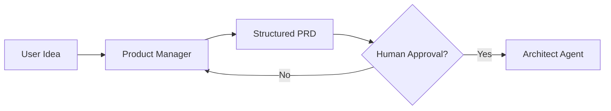

# Product Manager Agent

> **Goal:** Convert vague user ideas into structured PRDs with acceptance criteria.

The Product Manager Agent is the first agent in the pipeline, transforming raw feature requests into actionable specifications.

---

## Overview



---

## 1. Product Manager Agent Implementation

### 1.1 Create the Product Manager Node

Create `agent/nodes/product_manager.py`:

```python
import json
import re
from langchain_openai import ChatOpenAI
from agent.state import AgentState

llm = ChatOpenAI(model="gpt-4o", temperature=0.3)

PRODUCT_MANAGER_PROMPT = """You are a Senior Product Manager creating a Product Requirements Document.

User Request:
{user_request}

Previous Feedback (if any):
{feedback}

Create a comprehensive PRD with:

1. **Problem Statement**: What problem does this solve? Who is affected?
2. **User Stories**: 3-5 user stories in "As a [user], I want [goal], so that [benefit]" format
3. **Acceptance Criteria**: Testable criteria for each user story
4. **Edge Cases**: What could go wrong? What are the boundary conditions?
5. **Out of Scope**: What are we explicitly NOT building?
6. **Success Metrics**: How do we measure success?

Output JSON:
{{
  "title": "Feature title",
  "problem_statement": "Clear problem description",
  "user_stories": [
    {{
      "as_a": "user type",
      "i_want": "goal",
      "so_that": "benefit",
      "acceptance_criteria": ["criterion 1", "criterion 2"]
    }}
  ],
  "edge_cases": ["edge case 1", "edge case 2"],
  "out_of_scope": ["exclusion 1", "exclusion 2"],
  "success_metrics": ["metric 1", "metric 2"],
  "priority": "P0|P1|P2",
  "estimated_complexity": "S|M|L|XL"
}}
"""

def product_manager_node(state: AgentState) -> dict:
    """Generate a structured PRD from user input."""
    feedback = state.get("prd_feedback", "None - first draft")
    
    prompt = PRODUCT_MANAGER_PROMPT.format(
        user_request=state["task_description"],
        feedback=feedback
    )
    
    response = llm.invoke(prompt)
    content = response.content
    if isinstance(content, list):
        content = content[0] if content else ""
    content = content.strip()
    
    # Strip markdown
    if content.startswith("```"):
        content = re.sub(r"^```(?:json)?\n?", "", content)
        content = re.sub(r"\n?```$", "", content)
    
    try:
        prd = json.loads(content)
    except json.JSONDecodeError:
        prd = {"error": "Failed to parse PRD", "raw": content[:500]}
    
    return {
        "prd": prd,
        "status": "prd_ready",
        "requires_human_approval": True
    }
```

### 1.2 PRD Schema

Add to `agent/state.py`:

```python
class UserStory(BaseModel):
    as_a: str
    i_want: str
    so_that: str
    acceptance_criteria: List[str]

class PRD(BaseModel):
    title: str
    problem_statement: str
    user_stories: List[UserStory]
    edge_cases: List[str]
    out_of_scope: List[str]
    success_metrics: List[str]
    priority: Literal["P0", "P1", "P2"]
    estimated_complexity: Literal["S", "M", "L", "XL"]

class AgentState(TypedDict):
    # ... existing fields ...
    prd: Optional[PRD]
    prd_feedback: Optional[str]
    requires_human_approval: bool
```

---

## 2. Human Approval Gate

### 2.1 Approval Handler

Create `agent/nodes/approval_gate.py`:

```python
from agent.state import AgentState
from agent.adapters.linear_adapter import LinearAdapter

def format_prd_for_review(prd: dict) -> str:
    """Format PRD as markdown for human review."""
    stories = "\n".join(
        f"- As a **{s['as_a']}**, I want **{s['i_want']}**, so that **{s['so_that']}**\n"
        f"  - Criteria: {', '.join(s['acceptance_criteria'])}"
        for s in prd.get("user_stories", [])
    )
    
    return f"""# {prd.get('title', 'Untitled')}

## Problem Statement
{prd.get('problem_statement', 'N/A')}

## User Stories
{stories}

## Edge Cases
{chr(10).join('- ' + e for e in prd.get('edge_cases', []))}

## Out of Scope
{chr(10).join('- ' + e for e in prd.get('out_of_scope', []))}

## Success Metrics
{chr(10).join('- ' + m for m in prd.get('success_metrics', []))}

---
**Priority:** {prd.get('priority', 'P1')} | **Complexity:** {prd.get('estimated_complexity', 'M')}
"""

def approval_gate_node(state: AgentState) -> dict:
    """Post PRD for human review."""
    prd = state.get("prd")
    issue = state.get("current_issue")
    
    if not prd or not issue:
        return {"status": "failed", "messages": state.get("messages", []) + ["No PRD or issue"]}
    
    adapter = LinearAdapter()
    
    # Post PRD as comment
    prd_markdown = format_prd_for_review(prd)
    adapter.add_comment(issue.id, f"## 📋 PRD Ready for Review\n\n{prd_markdown}")
    
    # Transition to review state
    adapter.transition_issue(issue.id, "Human: Product Approve")
    
    return {
        "status": "awaiting_approval",
        "messages": state.get("messages", []) + ["PRD posted for human review"]
    }
```

---

## 3. Graph Integration

Update `agent/graph.py` to start with Product Manager:

```python
from agent.nodes.product_manager import product_manager_node
from agent.nodes.approval_gate import approval_gate_node

def build_graph():
    workflow = StateGraph(AgentState)
    
    # Add Product Manager at the start
    workflow.add_node("product_manager", product_manager_node)
    workflow.add_node("approval_gate", approval_gate_node)
    
    # ... existing nodes ...
    
    workflow.set_entry_point("product_manager")
    
    workflow.add_conditional_edges(
        "product_manager",
        lambda s: s["status"],
        {
            "prd_ready": "approval_gate",
            "failed": END
        }
    )
    
    # After approval, continue to architect
    workflow.add_edge("approval_gate", END)  # Pause here for human
    
    return workflow.compile()
```

---

## 4. Approval Callback

When human approves in Linear, a webhook or poll triggers:

```python
def on_prd_approved(issue_id: str):
    """Resume workflow after human approves PRD."""
    # Fetch the approved issue
    adapter = LinearAdapter()
    issue = adapter.get_issue(issue_id)
    
    # Continue from architect node
    state = load_state(issue_id)  # Load saved state
    state["status"] = "prd_approved"
    
    # Resume the graph from architect
    result = app.invoke(state, {"start_at": "architect"})
```

---

## 5. PRD Refinement Loop

If human rejects PRD with feedback:

```python
def on_prd_rejected(issue_id: str, feedback: str):
    """Handle PRD rejection with feedback."""
    state = load_state(issue_id)
    state["prd_feedback"] = feedback
    state["status"] = "drafting"
    
    # Re-run Product Manager node with feedback
    result = app.invoke(state, {"start_at": "product_manager"})
```
