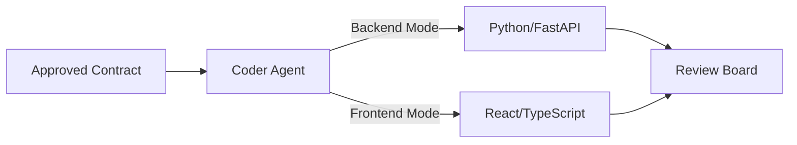

# Coder Agent

> **Goal:** Generate actual code implementations based on approved contracts.

The Coder Agent operates in multiple modes (Backend, Frontend) and produces production-ready code.

---

## Overview



---

## 1. Coder Agent Implementation

### 1.1 Create the Coder Node

Create `agent/nodes/coder.py`:

```python
import json
import re
from typing import Literal
from langchain_openai import ChatOpenAI
from agent.state import AgentState

llm = ChatOpenAI(model="gpt-4o", temperature=0)

BACKEND_PROMPT = """You are an expert Python/FastAPI developer.

Contract to implement:
{contract}

Task: {task}

Generate a complete backend implementation including:
1. Pydantic models matching the contract
2. FastAPI router with CRUD endpoints
3. Database operations (SQLAlchemy/async)
4. Input validation and error handling
5. Proper HTTP status codes

Output JSON:
{{
  "files": [
    {{
      "path": "src/models/example.py",
      "content": "full file content here"
    }},
    {{
      "path": "src/routers/example.py", 
      "content": "full file content here"
    }}
  ],
  "dependencies": ["package1", "package2"],
  "notes": "any implementation notes"
}}
"""

FRONTEND_PROMPT = """You are an expert React/TypeScript developer.

Contract to consume:
{contract}

Task: {task}

Generate a complete frontend implementation including:
1. TypeScript interfaces matching the contract
2. React components with proper typing
3. API client hooks (React Query/SWR style)
4. Form handling with validation
5. Loading and error states

Output JSON:
{{
  "files": [
    {{
      "path": "src/types/example.ts",
      "content": "full file content here"
    }},
    {{
      "path": "src/components/Example.tsx",
      "content": "full file content here"
    }},
    {{
      "path": "src/hooks/useExample.ts",
      "content": "full file content here"
    }}
  ],
  "dependencies": ["package1", "package2"],
  "notes": "any implementation notes"
}}
"""

def coder_node(state: AgentState) -> dict:
    """Generate code based on the contract and mode."""
    mode = state.get("coder_mode", "BACKEND")
    contract = state.get("current_contract", "{}")
    work_item = state.get("current_work_item")
    task = work_item.description if work_item else state.get("task_description", "")
    
    # Select prompt based on mode
    prompt_template = BACKEND_PROMPT if mode == "BACKEND" else FRONTEND_PROMPT
    prompt = prompt_template.format(contract=contract, task=task)
    
    response = llm.invoke(prompt)
    content = response.content
    if isinstance(content, list):
        content = content[0] if content else ""
    content = content.strip()
    
    # Strip markdown
    if content.startswith("```"):
        content = re.sub(r"^```(?:json)?\n?", "", content)
        content = re.sub(r"\n?```$", "", content)
    
    try:
        output = json.loads(content)
        files = output.get("files", [])
        dependencies = output.get("dependencies", [])
    except json.JSONDecodeError:
        files = []
        dependencies = []
    
    return {
        "generated_files": files,
        "new_dependencies": dependencies,
        "current_code": content,
        "status": "code_ready"
    }
```

---

## 2. File Writer Tool

### 2.1 Write Generated Files

Create `agent/tools/file_writer.py`:

```python
import os
from pathlib import Path
from typing import List, Tuple

def write_files(files: List[dict], base_path: str = ".") -> List[Tuple[str, bool]]:
    """Write generated files to disk.
    
    Returns list of (path, success) tuples.
    """
    results = []
    
    for file_info in files:
        file_path = Path(base_path) / file_info["path"]
        content = file_info["content"]
        
        try:
            # Create directories if needed
            file_path.parent.mkdir(parents=True, exist_ok=True)
            
            # Write content
            file_path.write_text(content)
            results.append((str(file_path), True))
        
        except Exception as e:
            results.append((str(file_path), False))
    
    return results

def format_file_for_diff(path: str, content: str) -> str:
    """Format a file for PR description."""
    extension = Path(path).suffix
    lang_map = {
        ".py": "python",
        ".ts": "typescript",
        ".tsx": "typescript",
        ".js": "javascript",
        ".json": "json"
    }
    lang = lang_map.get(extension, "")
    
    return f"### `{path}`\n\n```{lang}\n{content}\n```"
```

---

## 3. Code Validation

### 3.1 Lint & Type Check

Create `agent/tools/validator.py`:

```python
import subprocess
from typing import Tuple, List

def validate_python(files: List[str]) -> Tuple[bool, str]:
    """Run ruff and mypy on Python files."""
    python_files = [f for f in files if f.endswith(".py")]
    if not python_files:
        return True, "No Python files to validate"
    
    # Run ruff
    ruff_result = subprocess.run(
        ["ruff", "check"] + python_files,
        capture_output=True,
        text=True
    )
    
    if ruff_result.returncode != 0:
        return False, f"Ruff errors:\n{ruff_result.stdout}"
    
    # Run mypy
    mypy_result = subprocess.run(
        ["mypy", "--ignore-missing-imports"] + python_files,
        capture_output=True,
        text=True
    )
    
    if mypy_result.returncode != 0:
        return False, f"Type errors:\n{mypy_result.stdout}"
    
    return True, "Python validation passed"

def validate_typescript(files: List[str]) -> Tuple[bool, str]:
    """Run tsc and eslint on TypeScript files."""
    ts_files = [f for f in files if f.endswith((".ts", ".tsx"))]
    if not ts_files:
        return True, "No TypeScript files to validate"
    
    # Run tsc
    tsc_result = subprocess.run(
        ["npx", "tsc", "--noEmit"] + ts_files,
        capture_output=True,
        text=True
    )
    
    if tsc_result.returncode != 0:
        return False, f"TypeScript errors:\n{tsc_result.stdout}"
    
    # Run eslint
    eslint_result = subprocess.run(
        ["npx", "eslint"] + ts_files,
        capture_output=True,
        text=True
    )
    
    if eslint_result.returncode != 0:
        return False, f"ESLint errors:\n{eslint_result.stdout}"
    
    return True, "TypeScript validation passed"

def validate_code(files: List[str]) -> Tuple[bool, str]:
    """Validate all generated code."""
    py_ok, py_msg = validate_python(files)
    ts_ok, ts_msg = validate_typescript(files)
    
    if py_ok and ts_ok:
        return True, f"{py_msg}\n{ts_msg}"
    
    errors = []
    if not py_ok:
        errors.append(py_msg)
    if not ts_ok:
        errors.append(ts_msg)
    
    return False, "\n".join(errors)
```

---

## 4. Self-Correction Loop

### 4.1 Reviewer Feedback Handler

Update `agent/nodes/coder.py`:

```python
CORRECTION_PROMPT = """You are fixing code based on reviewer feedback.

Original code:
{code}

Validation/Review errors:
{errors}

Fix the issues and output the corrected files in the same JSON format.
Only include files that need changes.
"""

def coder_correction_node(state: AgentState) -> dict:
    """Fix code based on validation or review feedback."""
    errors = state.get("validation_errors") or state.get("review_concerns", [])
    code = state.get("current_code", "")
    
    prompt = CORRECTION_PROMPT.format(
        code=code,
        errors=errors
    )
    
    response = llm.invoke(prompt)
    content = response.content
    if isinstance(content, list):
        content = content[0] if content else ""
    content = content.strip()
    
    if content.startswith("```"):
        content = re.sub(r"^```(?:json)?\n?", "", content)
        content = re.sub(r"\n?```$", "", content)
    
    try:
        output = json.loads(content)
        files = output.get("files", [])
    except json.JSONDecodeError:
        files = []
    
    return {
        "generated_files": files,
        "current_code": content,
        "correction_count": state.get("correction_count", 0) + 1,
        "status": "code_ready"
    }
```

---

## 5. Graph Integration

```python
from agent.nodes.coder import coder_node, coder_correction_node
from agent.tools.validator import validate_code

def validation_node(state: AgentState) -> dict:
    """Validate generated code."""
    files = [f["path"] for f in state.get("generated_files", [])]
    valid, message = validate_code(files)
    
    if valid:
        return {"validation_status": "passed", "status": "reviewing"}
    
    return {
        "validation_status": "failed",
        "validation_errors": message,
        "status": "needs_correction"
    }

# In build_graph():
workflow.add_node("coder", coder_node)
workflow.add_node("validation", validation_node)
workflow.add_node("coder_correction", coder_correction_node)

workflow.add_edge("coder", "validation")

workflow.add_conditional_edges(
    "validation",
    lambda s: s["validation_status"],
    {
        "passed": "security",  # Continue to review
        "failed": "coder_correction"
    }
)

# Correction loops back to validation
workflow.add_edge("coder_correction", "validation")
```

---

## 6. Mode Switching

The Stack Manager sets the coder mode:

```python
def stack_manager_node(state: AgentState) -> dict:
    current_item = state.get("current_work_item")
    
    # Set coder mode based on work item type
    coder_mode = {
        "CONTRACT": "CONTRACT",  # Uses contractor node
        "BACKEND": "BACKEND",
        "FRONTEND": "FRONTEND"
    }.get(current_item.type, "BACKEND")
    
    return {
        "coder_mode": coder_mode,
        # ... other state updates
    }
```

---

## 7. Generated File Patterns

### Backend Files
```
src/
├── models/
│   └── {feature}.py          # Pydantic models
├── routers/
│   └── {feature}.py          # FastAPI routes
├── services/
│   └── {feature}_service.py  # Business logic
└── repositories/
    └── {feature}_repo.py     # Database operations
```

### Frontend Files
```
src/
├── types/
│   └── {feature}.ts          # TypeScript interfaces
├── components/
│   └── {Feature}/
│       ├── index.tsx         # Main component
│       └── {Feature}.test.tsx
├── hooks/
│   └── use{Feature}.ts       # Data fetching hooks
└── api/
    └── {feature}.ts          # API client
```
